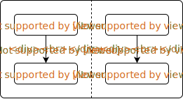
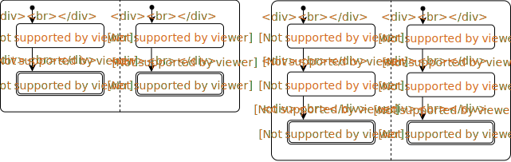

# ConcurrentDesign
- **Sequential Program**
  - assignment statement
  - sequential composition
  - conditional statement
  - repetitive statement
  
- **Concurrent Program**
  - parallel composition
  - mutual exclusion
  - condition synchronization

## Parallel Composition

**1.S1 || ... || Sn** => parallel composition of process S1 to Sn

**2.fork & join**
  - **fork**：allows processes to be started, *start()* in Java & Python, go in go
  - **join**：waits for process to terminate, *[join()](https://www.geeksforgeeks.org/joining-threads-in-java/)* in Java & Python
  
**3. In State Diagram, parallel composition is visualized by a dashed line and transitions are atomic steps**:

   

## Mutual Exclusion
  - The goal of Mutual Exclusion is to avoid interference in parallel composition.
    
**1.Atomicity**
  - **Atomicity brackets**: `<`x := x + 1`>`
  - Only access to `individual basic variables` and `array elements of basic types` is atomic, e.g. `x := x + 1` is equal to `<x> := <x> + <1>` which is not atomic
  - Reading and Writing to a `word` from and to memory is atomic. In Java, access to 
    ```java
    int boolean float pointer
    ```
    are atomic since they are `word-sized` and access to
    ```java
    double long
    ```
    are not.
   - Auxiliary variables are needed to express atomicity in state diagrams.
   ```
   <x := x + 1>||<x := x + 2>                   <x> := <x + 1>||<x> := <x + 2>
   ```
      

**2.Non-Interference**
  - Proof for Sequential program: `Pre-condition`, `Transition`, `Post-condition`
  - Proof for concurrent program: `Pre-condition`, `Transition`, `Post-condition`, `Non-interference`
