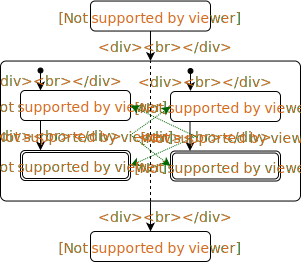

# ConcurrentDesign
- **Sequential Program**
  - assignment statement
  - sequential composition
  - conditional statement
  - repetitive statement
  
- **Concurrent Program**
  - [parallel composition](#parallel)
  - [mutual exclusion](#mutual)
  - [condition synchronization](#condition)

## <a name = "parallel">Parallel Composition</a>

**1.S1 || ... || Sn** => parallel composition of process S1 to Sn

**2.fork & join**
  - **fork**：allows processes to be started, *start()* in Java & Python, go in go
  - **join**：waits for process to terminate, *[join()](https://www.geeksforgeeks.org/joining-threads-in-java/)* in Java & Python
  
**3.** In State Diagram, parallel composition is visualized by a dashed line and **transitions are atomic steps**:

   
   
**4. Threads** are used to implement parallel composition
  - [Threads in Java](https://docs.oracle.com/javase/tutorial/essential/concurrency/)
  ```Java
  
  ```
  - [Threads in Python](https://docs.python.org/2/library/threading.html)
  ```Java
  
  ```

## <a name = "mutual">Mutual Exclusion</a>
  - The goal of Mutual Exclusion is to allows only one process be in its [`critical sections`](#critical).
  - Mutual Exclusion is typically implemented by `locks` that protect [`critical sections`](#critical).
    
**1.Atomicity**
  - **Atomicity brackets**: `<`x := x + 1`>`
  - Only access to `individual basic variables` and `array elements of basic types` is atomic, e.g. `x := x + 1` is equal to `<x> := <x> + <1>` which is not atomic
  - Reading and Writing to a `word` from and to memory is atomic. In Java, access to 
    ```java
    int boolean float pointer
    ```
    are atomic since they are `word-sized` and access to
    ```java
    double long
    ```
    are not.
   - Auxiliary variables are needed to express atomicity in state diagrams.
   ```
   <x := x + 1>||<x := x + 2>                   <x> := <x + 1>||<x> := <x + 2>
   ```
   

**2.Non-Interference**
  - Proof for Sequential program: `Pre-condition`, `Transition`, `Post-condition`
  - Proof for concurrent program: `Pre-condition`, `Transition`, `Post-condition`, `Non-interference`
  - Weakening for Non-interference:
  
     
     
## <a name = "condition">Condition Synchronization</a>
  - Condition Synchronization delays a process until another establishes a certain condition.
  
## Properties of Concurrent Programs
**- Safety**
  - All states in all traces are good, expressed by invariance properties
  
**- Liveness**
  - All traces will eventually lead to a good state/result, implicitly including termination
  
**- <a name = 'critical'>Critical Section</a>**
  - Resources shared by different processes/threads
