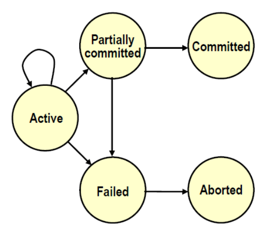
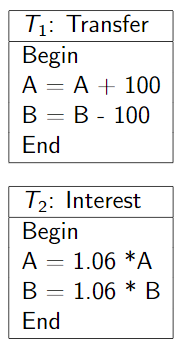
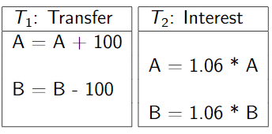
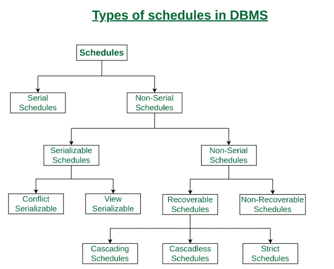

# Transactions & Concurrency in DBMS
## Transactions
- A transaction is **a unit of program execution** that **accesses** and possibly **updates** data
- During transaction the database maybe temporarily inconsistent but when the transaction completes(is committed), the database must be consistent.
- **Transaction States :** 
  - **Active** - initial state and it stays in this state while executing
  - **Partially committed** - after final statement executed
  - **Failed** - after the discovery that normal execution can no longer procceed
  - **Aborted** - after the traction fails the database restores to its state prior to the start of the transaction, two options after aborted: restart / kill
  - **Committed** - after successful completion
</img>
- **Properties of a transaction** ensured by DBMS:
  - **Atomicity** - inconsistent state should not be visible to users, database keeps track of old consistent values and restores values if a transaction fails
  - **Consistency** - A transaction must take the database from consistent state to consistent state
  - **Isolation** - Any one transaction can be isolated from other transaction
  - **Durability** - Once a transaction completes successfully, all the updates persist
## [Schedule of Transactions](https://www.geeksforgeeks.org/types-of-schedules-in-dbms/)
  - R(O) denotes read of object O
    W(O) denotes write of object O
    schedule must end with Abort or Commit
  - **Serial Execution**:
  
</img>
  - **Interleaved Execution**:
  
</img>
  - **Schedule**:
  
</img>
  - **Conflict Operation**: 
    - belong to different transactions 
    - operate on same item
    - at least one of them is write
  - **Conflict Serializable**: if it can be transformed into a serial schedule by swapping non-conflicting operations.
  - **View Serializable**: if it is view equivalent(initial read, final write, update read) to a serial schedule.
