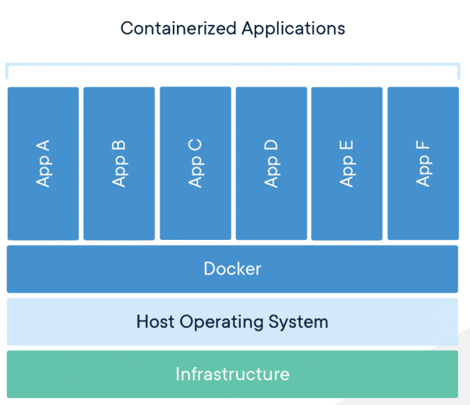

# Docker
- Isolated environment for each container of application
- No overlapping between each other
- code --build with docker file--> docker image --run on docker engine--> docker container
## [Docker Container](https://www.docker.com/resources/what-container)
</img>

## Basic Commands:
- #docker run <image>
  run the image
- #docker start <name|id>
- #docker stop <name|id>
- #docker ps []
