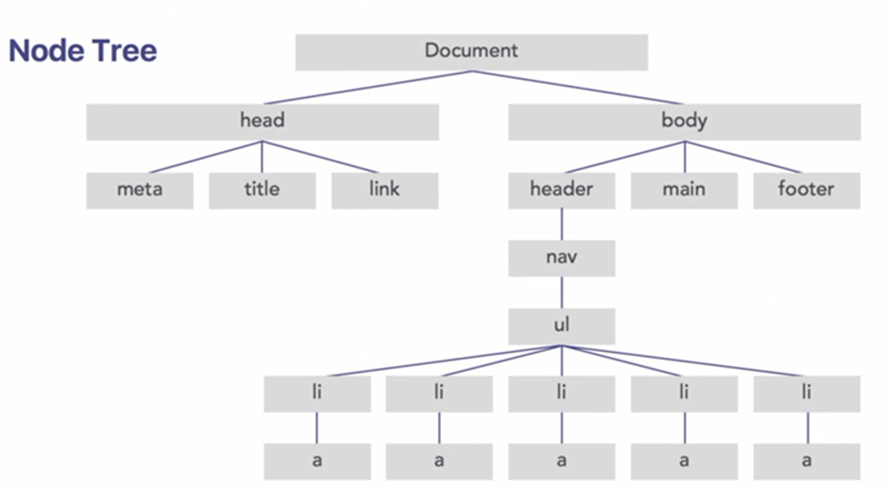

# JavaScript
- JS confirms to the ECMAScript, and browsers use ECMAScript to interpret JavaScript.
- ECMAScript6(ES6) supports Babel
- Angular, React, Vue for front-end
- Node for server-side(back-end)
- Place the `<script></script>` at the very bottom as necessary if you want HTML shows correctly, since the code runs top-down.
- `defer` keyword allows to run JS after the page is loaded.

## Connect JS to HTML
suppose there is a JS file named `main.js` and it is supposed to be connected to the following html
```html
<!DOCTYPE html>
<html lang="en" dir="ltr">
  <head>
    <meta charset="utf-8">
    <title></title>
    <script src="./main.js">
    </script>
  </head>
  <body>
    
  </body>
</html>
```

## Syntax
- ### alert
pop up a window with a string in the browser
```Javascript
alert("Hello World!");
```
- ### prompt
pop up a window to get a string as input
```Javascript
var value = prompt("Enter a value: ");
```
- ### Comment
same as most languages
```Javascript
// this is a line of comment
```
- ### Calculation
others same, division in JS is true division
```Javascript
2/5;   //result is 0.4
```
- ### Strings
```Javascript
"Js".length;   // gives the length of the 
"Js" + "Ok";   // concatenate two strings
"Js"[0];       // index
```
- ### Variable
declare a variable using keyword `var` and initialize it
```Javascript
var bankAccount = 100;
```
- ### Console Output
```Javascript
console.log("Hi");
```
- ### Type Conversion
Js supports auto type conversion when doing comparison with `==`, `===` will check for both value and type equality
```Javascript
"1" == 1;   //true
"1" === 1;  //false
```
- ### Objects
```Javascript
var car = {type:"Toyota",
year:1990, 
model:"Camry",
repair: function(){
  return True;
},
};
```
`car[type]` will get "Toyota"

- ### Operation on Integer and String
 ```Javascript
 var sum = "1" + 1 // sum = "11"
 var sub = "5" - 1 // sub = 1
 var mul = "5" * 10 // mul= 50
 var div = "5" / 1 // div = 5
 var sum = "a" + 1 // sum = NaN
 ```

- ### Empty variable but not undefined - null

- ### Functions
```Javascript
function myFunc(){
  //function scope
}
```
- ### Ternary Operators
condition ? True : False
```Javascript
a > b ? console.log("a is bigger") : console.log("b is bigger");
```

- ### Anonymous Functions
```Javascript
var AFunc = function(){
  //function scope
}
AFunc();
```
- ### Document Object Model(DOM)
</img>
