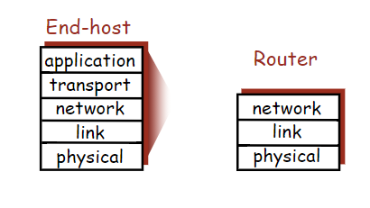
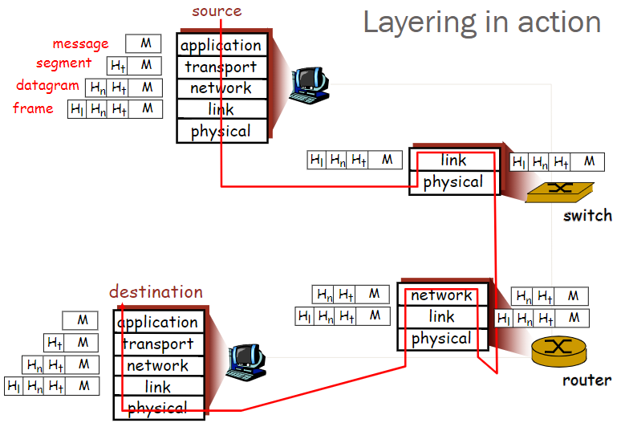

# Internet Architecture and Design Principles
## Protocols
- Protocols define **format and order** of messages sent and received, among network entities, and **actions required** on message transmission.
- e.g. TCP, IP, HTTP, SMTP, SSH, FTP
### Protocol Layers
- Imaginary 2-tier:
```
Application    [SMTP]  [SSH]  [FTP]  [HTTP]
----------------------------------------------
Transmission   [Coaxial cable] [Fiber optic]
Media

* components are interconnected with each other
```
- Problem of imaginary 2-tier:

 ```
A new application needs to interface to all existing media, adding a new application requires O(m) work, where m = # of media
A new media requires all existing application to be modified, adding a new media requires O(a) work, where a = # of applications
 ```
- Solution: Introducing an intermediate layer that provides a single abstraction for various technologies, O(1) work to add media/app
```
Application |      [SMTP]  [SSH]  [NFS]
---------------------|--------|-----|-----------
Intermediate|        |        |     |
Layer       |    ["one intermediate layer"]
------------------------|--------------|--------
Transmission|   [Coaxial cable]  [Fiber optic]
Media       |
```
## Network Architecture
### Network Modularity
- Many software components **distributed** across routers and hosts
- Must decide:
 - **How** to break system into modules
 - **Where** components should be distributed

### Layering
- Layering is a particular form of **modularization**
- The system is decomposed into a **vertical hierarchy** of logically distinct layers
- Each layer **only communicates with its adjacent layers**
- Rigid structure: easy reuse, performance may suffer
</img>
- **Concept of layers**:
 - **Service**: What a layer does
 - **Service Interface**: How to access the service
 - **Protocol**: how is the service implemented(set of rules and message formats)

### Internet Protocol Architecture
```
|---Application Layer---|     telnet, ftp, SMTP, HTTP, DNS   \
|----Transport Layer----|     TCP, UDP                       | TCP/IP   
|-----Network Layer-----|     IP, ICMP, IGMP                 |  Suite  ----> Basis for networks
|---(Data) Link Layer---|     FDDI, ATM, Ethernet            /
|----Physical  Layer----|
```
- Computers(hosts) have all five layers
- Routers does not have Application and Transport layers
- Switches only have Link and Physical layers
- **Layering in action**:
 </img>
 - A header is added when a message goes down one layer and is removed when goes up one layer
 - When a hop receive a message, it goes up to top then goes down to bottom to be sent to another hop
