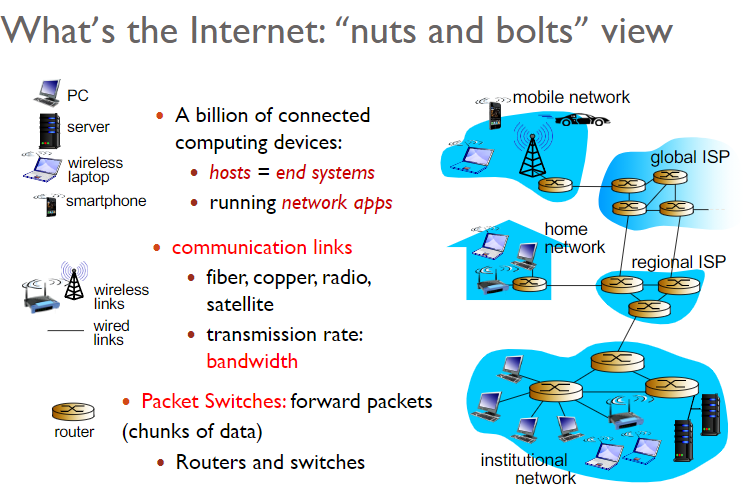
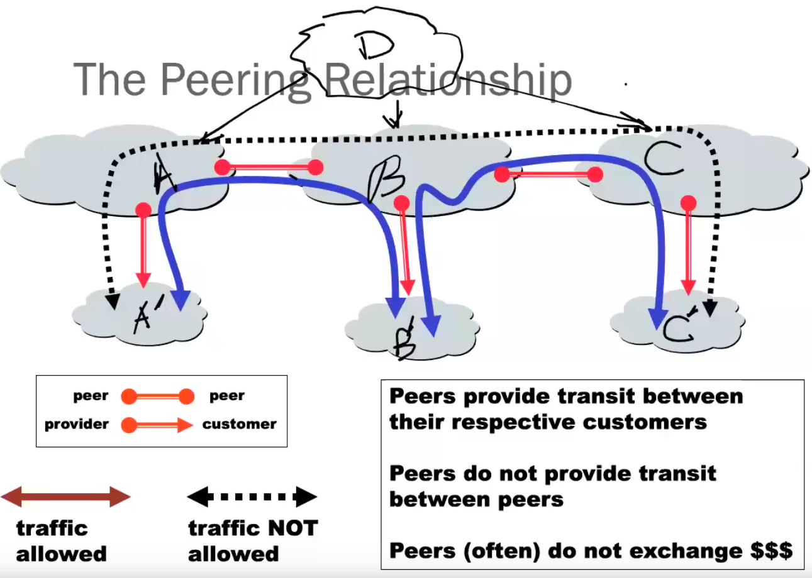

# Computer Networks & Security
- **Computer network** is a **system** for **communication** among two or more computers.
- Both software & hardware.
- Learn to **develop distributed application** and to **configure and operate as a system administrator**.

## Internet
- End host <-> routers.... <-> server
</img>

### ISP - Internet service provider
- End systems/hosts access the Internet throught ISPs
- Types:
  - Tier-1
  - Tier-2
  - Tier-3
  - Local ISP
- Connection type:
  - Custmers and Providers(e.g. Bell and Your PC)： Customer pays provider for access to the Internet.
  - Peering Relationship(e.g. CA SP and US SP): Peers provide transit between their respective customers and do not provide transit between peers. 
</img>
- That means two customers cannot directly communicate with each other, need to use provider and go to higher tiers.
A' to C': A' => A => D => C => C'
- Tier-1 providers interconnect at public **Networks Access Points(NAPs)**
