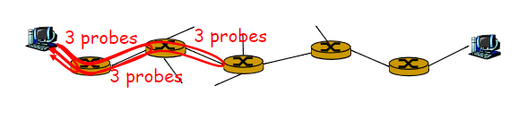
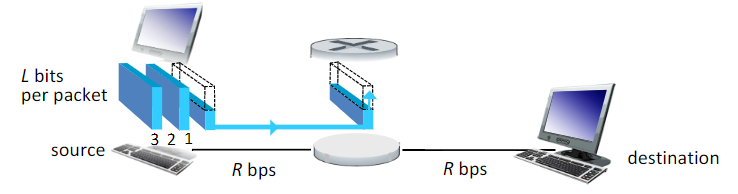
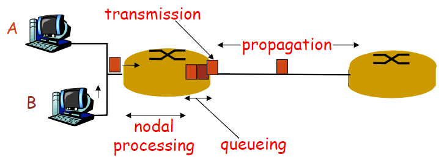

# Computer Networks & Security
- **Computer network** is a **system** for **communication** among two or more computers.
- Both software & hardware.
- Learn to **develop distributed application** and to **configure and operate as a system administrator**.

## Internet
- End host <-> routers.... <-> server
</img>

### ISP - Internet service provider
- End systems/hosts access the Internet throught ISPs
- Types:
  - Tier-1
  - Tier-2
  - Tier-3
  - Local ISP
- Connection type:
  - Custmers and Providers(e.g. Bell and Your PC)： Customer pays provider for access to the Internet.
  - Peering Relationship(e.g. CA SP and US SP): Peers provide transit between their respective customers and do not provide transit between peers. 
</img>
  - That means two customers cannot directly communicate with each other, need to use provider and go to higher tiers.
A' to C': A' => A => D => C => C'
  - Tier-1 providers interconnect at public **Networks Access Points(NAPs)**

### Traceroute
- Provides **delay measurement** from source to each router along the end-to-end Internet path towards destination.
- Method:
``` 
    For all i:
      Sender send three packets to router i
      Router i return packets to the sender
      Sender measure the interval between transmission and reply
      Packets sent to router i need to be passed by router i-1
 ```
</img>

### Packet-Switching
- **Store-and-forward** Mechanism
- Application message is broken down into packets(encapsulated), each ~ 1000 bytes.
- Each packet **must arrive at a router** before it can be transmitted on next link.
- Individual packet could be forwarded **along different network paths** from source to destination.
</img>
- **Loss & Delay**
  </img>
  - Packets stores in router buffers
  - arrival rate to buffer > output rate from buffer
  - **Loss:** No free buffers, packet being dropped
  - **Delay:** 
  ```
  1. Packets queueing in the buffer(queueing delay)
  2. Packets transmit from buffer to the link(transmission delay)
  3. Packets travels on the wires(propagation delay)
  4. Packets being checked for bit errors, router determine output link, deep packet inspection(processing delay)
  ```
  - **Queueing delay**: 
  ```
  R = Link bandwidth(bytes/s)
  L = packet length(bits)
  a = average packet arrival(packet/s)
  traffic intensity = L*a/R

  queueing delay
  |                      * |
  |                      * |
  |                     *  |
  |                    *   |
  |                   *    | 
  |                  *     | 
  |                *       | 
  |             *          | 
  |         *              | 
  |    *                   | 
  |----------------------------L*a/R
                           1
  L*a/R ~ 0: average queueing delay small
  L*a/R => 1: delays become large
  L*a/R > 1: arriving > served, average delay infinite!
  ```
  - **Transimission delay**: from buffer to the link
  ```
  R = link bandwith(bps)
  L = packet length(bits)
  time to send the packet into link = L/R
  ```
  - **Propagation delay**: delay in the wire
  ```
  d = length of the physical link wire
  s = propagation speed in medium (light speed ~3*10^8m/s)
  propagation delay = d/s
  ```
  
